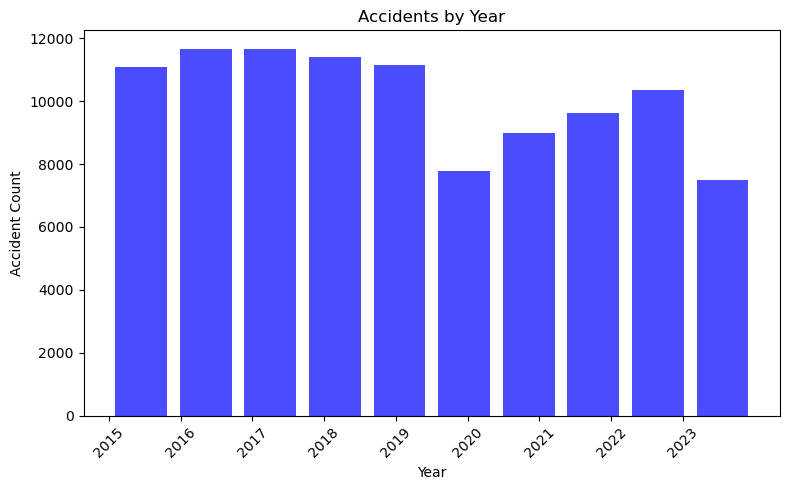
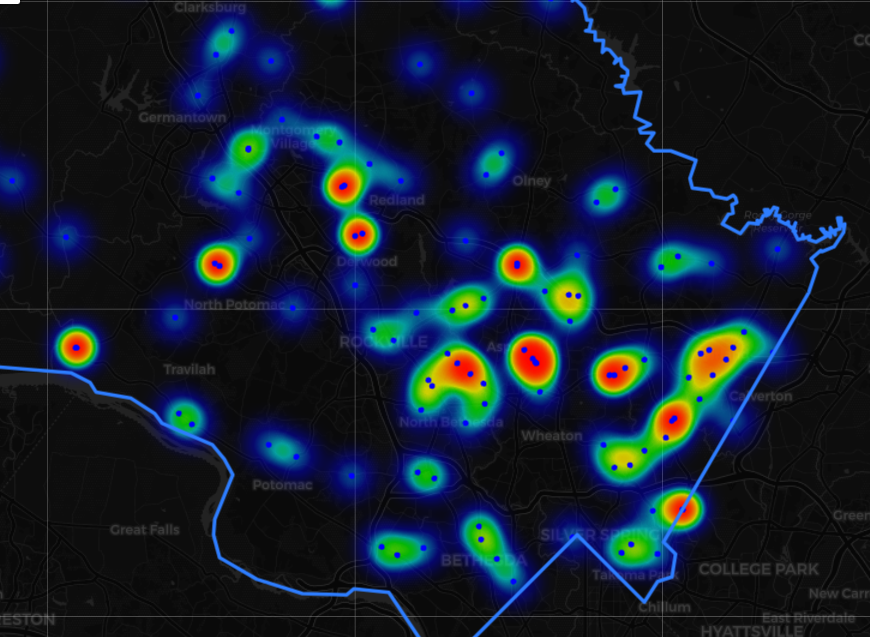
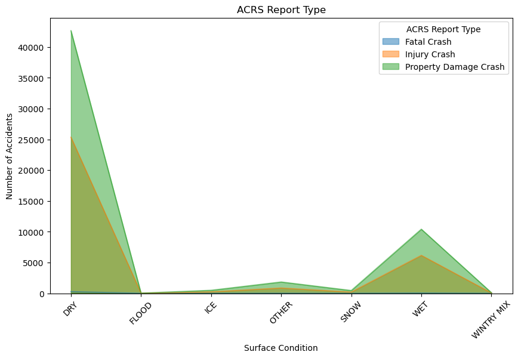
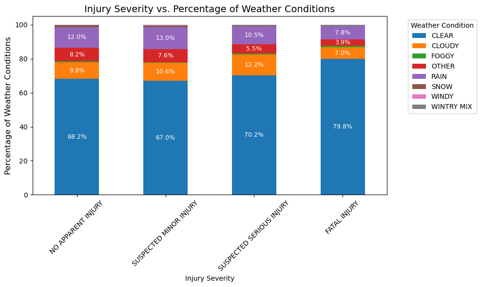
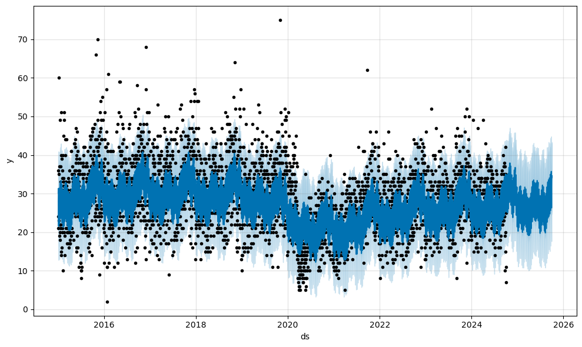
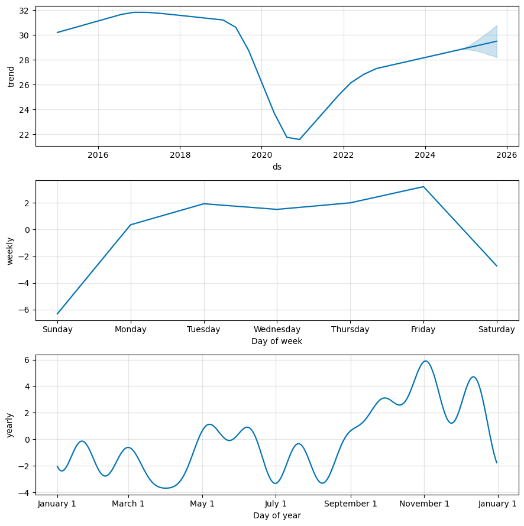

# Crash Data Analysis for Montgomery County, Maryland

## Project Overview
This project analyzes vehicle crash data from Montgomery County, Maryland, focusing on multiple factors such as date/time, geolocation, road surface conditions, and weather patterns. Using tools like **GeoPandas** and **Prophet**, this project explores spatial trends and predicts crash patterns based on historical data. 

The analysis aims to provide insights into how various factors contribute to vehicle accidents, which can aid in improving road safety strategies in Montgomery County.

## Table of Contents
- [Data Source](#data-source)
- [Project Structure](#project-structure)
- [Installation](#installation)
- [Usage](#usage)
- [Analysis Descriptions](#analysis-descriptions)
    - [Crash Data Downloader](#crash-data-downloader)
    - [Datetime Analysis](#datetime-analysis)
    - [Geolocation Analysis](#geolocation-analysis)
    - [Surface Condition Analysis](#surface-condition-analysis)
    - [Weather Analysis](#weather-analysis)
- [Results](#results)
- [Contributing](#contributing)
- [License](#license)

## Data Source
The crash data for this project was obtained from [data.gov](https://data.gov). It includes information on vehicle crashes in Montgomery County, Maryland, including weather conditions, road surface conditions, geolocation, and timestamps for each crash.

## Project Structure
The project is organized into three main folders: `Code`, `Documentation`, and `Resources`.
```
.
├── Code
│   ├── crash_data_downloader.ipynb      # Downloads and cleans the crash data
│   ├── datetime_analysis.ipynb          # Analysis based on various datetime parameters
│   ├── geolocation_analysis.ipynb       # Analysis based on geolocation using GeoPandas
│   ├── surface_condition_analysis.ipynb # Analysis based on road surface conditions
│   ├── weather_analysis.ipynb           # Analysis based on weather conditions, with Prophet predictions
│
├── Documentation
│   ├── project_overview.md              # High-level overview of the project
│   └── detailed_analysis.md             # Detailed analysis and findings
│
├── Resources
│   ├── Montgomery_Crash_Data.csv        # Raw crash data (downloaded CSV)
│   └── Montgomery_County.json           # Geo boundary JSON for Montgomery County
│
└── README.md                            # Project README
```
- `Code/`: Contains all the Jupyter Notebook files for downloading, cleaning, and analyzing the crash data.
- `Documentation/`: Contains additional documentation, such as the project overview and detailed analysis reports.
- `Resources/`: Contains the raw crash data (CSV) and geographical boundary information (JSON) for Montgomery county of Maryland.

## Installation
To run the notebooks and analyze the crash data, you need to install the required Python libraries. The recommended way is to create a virtual environment and install the dependencies listed in `requirements.txt` (if provided) or install the necessary libraries manually.

### Required Libraries
- `pandas`
- `geopandas`
- `matplotlib`
- `prophet`
- `requests`
- `folium`
- `us`

### Setup Steps

1. **Clone the repository**:
    ```bash
    git clone <repository-url>
    cd <repository-folder>
    ```

2. **Create a virtual environment** (optional but recommended):
    ```bash
    python3 -m venv venv
    source venv/bin/activate  # On Windows, use venv\Scripts\activate
    ```

3. **Install dependencies**:
    ```bash
    pip install -r requirements.txt
    ```

4. **Run Jupyter Notebooks**:
    ```bash
    jupyter notebook
    ```

## Usage
Each Jupyter Notebook file in the `Code/` folder performs specific types of analysis. You can explore the data by running the notebooks individually. Detailed documentation is provided within each notebook.

### Example Usage

- To download and clean the data, run the `crash_data_downloader.ipynb` notebook in the `Code/` folder.
> **IMPORTANT:** Following notebooks will need `crash_data_downloader.ipynb` notebook executed **at least once** to generate the CSV used as a source. Please run the downloader again to generate CSV with fresh data from data.gov 
- For datetime-based crash analysis, run the `datetime_analysis.ipynb` notebook in the `Code/` folder.
- For geolocation analysis using GeoPandas and interactive plots, run the `geolocation_analysis.ipynb` notebook in the `Code/` folder.
- For road surface condition analysis, run the `surface_condition_analysis.ipynb` notebook in the `Code/` folder.
- For weather condition analysis and predictions using Prophet, run the `weather_analysis.ipynb` notebook in the `Code/` folder.

## Analysis Descriptions

### Crash Data Downloader
- **File**: `crash_data_downloader.ipynb`
- **Description**: This notebook is responsible for downloading the crash data from the source and cleaning it for further analysis. It handles data parsing, missing value treatments, and prepares the dataset for subsequent analyses.

### Datetime Analysis
- **File**: `datetime_analysis.ipynb`
- **Description**: This notebook focuses on analyzing crash patterns based on time and date parameters such as year, month, day of the week, and hour of the day. It visualizes trends and attempts to identify potential peak crash times.

### Geolocation Analysis
- **File**: `geolocation_analysis.ipynb`
- **Description**: This notebook provides a spatial analysis of the crashes using `GeoPandas`. It includes mapping crash locations, identifying crash hotspots, and generating interactive visualizations for better insights.

### Surface Condition Analysis
- **File**: `surface_condition_analysis.ipynb`
- **Description**: This notebook analyzes the influence of road surface conditions (e.g., wet, dry, icy) on the frequency and severity of vehicle crashes. It visualizes the impact of different surface conditions and compares them with crash severity.

### Weather Analysis
- **File**: `weather_analysis.ipynb`
- **Description**: This notebook focuses on weather-related crash analysis. It looks into the correlation between weather conditions (e.g., rain, fog, snow) and crashes. **Prophet** is also used for seasonal pattern detection and future crash predictions based on weather data.

## Analysis Results
The analyses provided insights into various factors affecting vehicle crashes in Montgomery County, Maryland, including:
- **Time-based patterns**: 

    - Overall number of crashes are following a bucket of 10k to 12k per year.
    - Ther is a significan reduction in crashes during COVID-19 era but it is coming back to follow the same pattern.
- **Geolocation analysis**:

    - There are hotspots for frequent crashes around intersections.
    - There are few highway patches were fatal crashes happens more frequently.
    - There are pockets of crashes during snow days.
- **Surface condition analysis**:

    - Surface conditions do not correlate much with number of crashes and severity of injuries.
- **Weather analysis**: 

    - Weather conditions do not correlate much with number of crashes and severity of injuries.
- **Near future predictions**:


    - Even though the year 2020 has resulted into significant reduction in accidents, the prediction suggests that the trend is falling back on its historical number.
    - Fridays look like worst day in terms of driving saftey.
    - November appears to be worse month in terms of accidents monthly distribution.

## Contributing
We welcome contributions to the project! If you'd like to contribute, please follow these steps:
1. Fork the repository.
2. Create a new branch for your feature or bug fix.
3. Submit a pull request describing your changes.

## License
This project is licensed under the MIT License - see the [LICENSE](LICENSE) file for details.